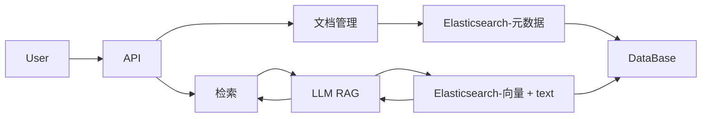

# Basic Structure

# Meta Data

## DocumentMetadata 

    doc_id : string; 

    filename : string;

    upload_time : Date;

    custom_metadata: {[key: string]: string | number};

## ChunkMetaData

    chunck_id: string;

    doc_id: string;

    page_number: number;

    start_line: number;

    end_line: number;

    custom_metadata: { ... };  potential inheretance here

