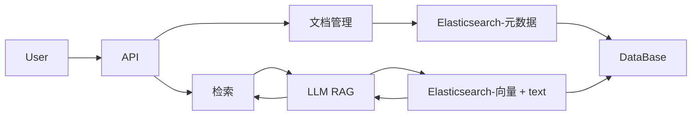

# Basic Structure

# 文档管理

## DocumentMetadata 

    doc_id : string; 

    filename : string;

    upload_time : Date;

    custom_metadata: {[key: string]: string | number};

## ChunkMetaData

    chunck_id: string;

    doc_id: string;

    page_number: number;

    start_line: number;

    end_line: number;

    custom_metadata: { ... };  potential inheretance here

## Chunking Strategy

1. table & title extraction
2. semantic chunking：SentenceSplitter(llamaindex)
3. child chunk -> parent document

首先识别表格和标题作为独立块，然后对文本进行语义拆分，检索时根据文本块定位文档

## Storage
### chunck

{

"text": string

"embedding": vector

"metadata": dict

    {
        "chunk_id": string

        "doc_id": string
        
        "page_number": int

        "start_line": int

        "end_line": int

        "custom": flattened(supported by es)

        {

            "company_id": string | int

            "year": int

            "section": string

        }

    }

}

